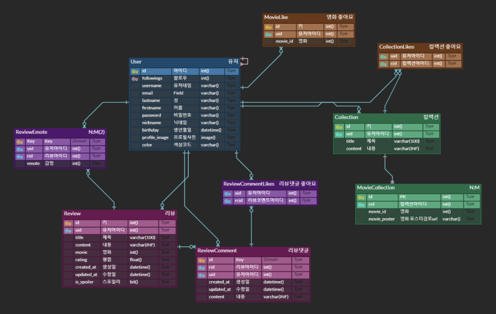

# 프로젝트 기획

## 프로젝트 개요

| 프로젝트 목적 | 영화 리뷰 사이트를 처음 이용하는 비전문적인 영화 시청자를 위한 직관적이고 사용하기 편한 영화 리뷰 공유 웹사이트 제작 |
| --- | --- |
| 프로젝트 기간 | 5/9 ~ 5/19 |
| 발표 날짜 | 5/19 |
| 팀명 | 8은 안으로 굽조 |
| 주제 | 영화 리뷰 공유 웹사이트 |

## 기술 스택

	
	
	
	 
	
	
  
  
	 

## 개발 역할 분담

| 이름 | 역할 |
| --- | --- |
| 박현준 | 조장님, 프론트엔드 개발 |
| 서유영 | 프론트엔드 개발 |
| 노현석 | 풀스택 마에스트로(reviews) |
| 이수한 | 백엔드 개발(accounts) |
| 최수현 | 백엔드 개발(movies) |

## 주제 사전 조사 & 분석

[왓챠피디아](https://pedia.watcha.com/ko-KR)

[TMDB API](https://developer.themoviedb.org/reference)

[롯데시네마](https://www.lottecinema.co.kr/NLCHS)

[메가박스](https://www.megabox.co.kr/)

## 서비스 주요 기능

  
 회원관리 

  

    - 회원가입
    - 로그인
    - 로그아웃
    - 회원 프로필
    - 팔로잉
  

 영화 

  - 영화 장르별 검색
  - 영화 예고편
  - 트렌드 검색
  - 리뷰 작성
  - 컬렉션
  - 좋아요
  - 비슷한 작품

리뷰

  - 별점 차트
  - 댓글

## 모델(Model) 설계

## 화면(Template) 설계

  
메인

  

  
  

회원가입 / 로그인

  - 회원가입
  
  - 로그인
  

검색

  - 키워드로 검색
  
  - 장르로 검색
  

영화 상세

  

인물

  

컬렉션

  

